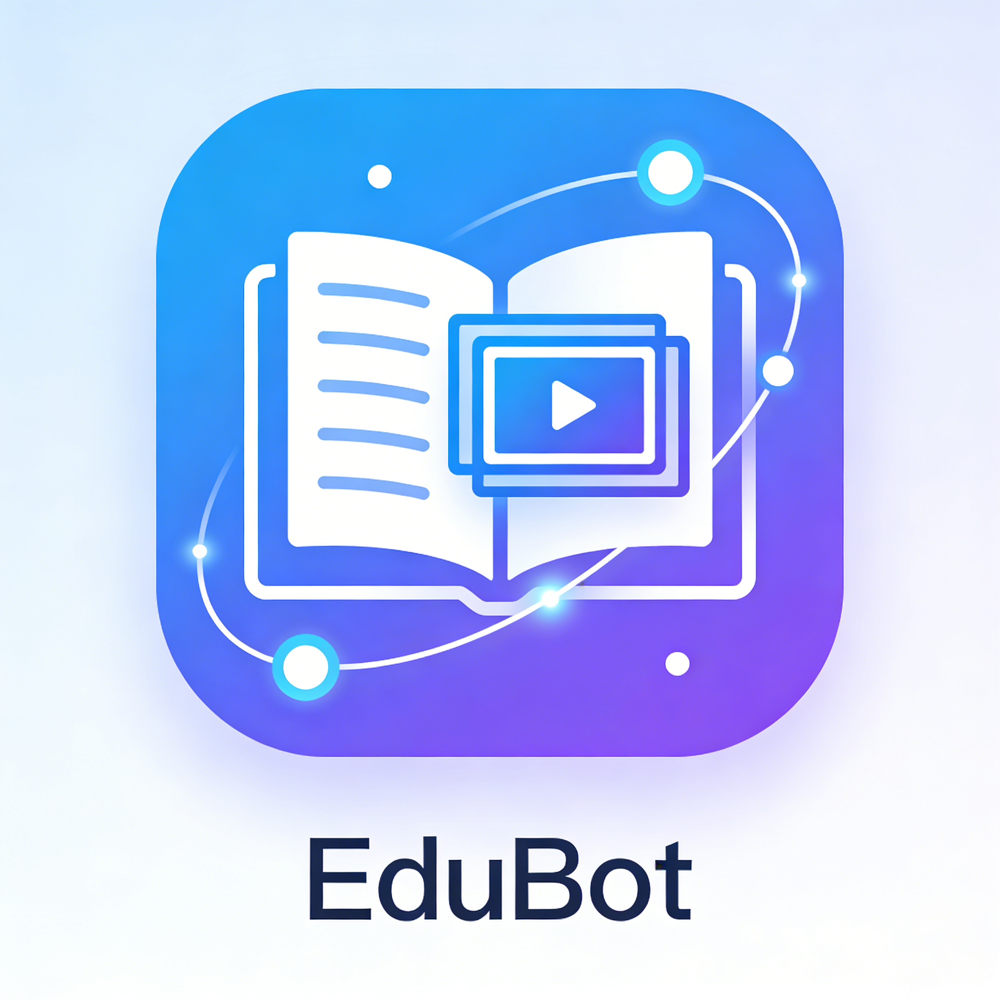

<div align="center">
  
  <h1>🎓 EduBot — AI-Powered Education Assistant</h1>
  <p>An intelligent teaching assistant built on <a href="https://github.com/HKUDS/nanobot">nanobot</a> that helps educators design lesson plans, manage course materials, and interact with students via a modern web interface.</p>
  <p>
    
    
    
    
    
  </p>
</div>

---

## ✨ Features

| Feature | Description |
|---------|-------------|
| 💬 **AI Chat** | Conversational AI assistant powered by any LLM (OpenAI, Claude, Gemini, DeepSeek, etc.) |
| 📝 **Lesson Plan Generator** | Auto-generates structured, pedagogically sound lesson plans in Chinese or English |
| 🎬 **Video Prompt Generator** | Converts lesson plans into storyboard-style prompts for educational video production |
| 📚 **Document Library** | Import, index, and semantically search course materials (PDF, DOCX, TXT, Markdown) |
| 🧩 **Skills & MCP** | Extend agent capabilities via custom skills or Model Context Protocol (MCP) servers |
| 📁 **File Manager** | Browse and edit workspace files directly from the web UI |
| ⚙️ **Config Panel** | Manage API keys, LLM providers, and agent settings through the browser |

---

##  Demo


[](https://www.bilibili.com/video/BV1gqDvBkExm/)


---

## 🏗️ Architecture

```
EduBot
├── nanobot/              # Core agent framework (based on nanobot)
│   ├── agent/
│   │   ├── tools/
│   │   │   ├── education_lesson.py    # Lesson plan & video prompt tools
│   │   │   └── education_document.py  # Document import / vector search
│   │   └── loop.py                    # Agent reasoning loop
│   ├── api/
│   │   └── app.py        # FastAPI backend (REST API)
│   ├── channels/         # Chat platform integrations
│   ├── providers/        # LLM provider adapters
│   └── frontend/         # Next.js web console
│       └── app/page.tsx  # Main UI (chat, config, skills, files, docs)
└── workspace/            # Agent workspace (memory, skills, sessions)
```

---

## 📦 Installation

### Prerequisites

- Python ≥ 3.11
- Node.js ≥ 18 (for the web frontend)

### 1. Clone the repository

```bash
git clone https://github.com/10and01/EduBot.git
cd EduBot
```

### 2. Install Python dependencies

```bash
pip install -e ./nanobot
```

Or with [uv](https://github.com/astral-sh/uv) (faster):

```bash
uv pip install -e ./nanobot
```

### 3. Install frontend dependencies

```bash
cd nanobot/frontend
npm install
```

---

## 🚀 Quick Start

### Configure your LLM provider

Create or edit `~/.nanobot/config.json`:

```json
{
  "providers": {
    "openrouter": {
      "apiKey": "sk-or-v1-YOUR_KEY"
    }
  },
  "agents": {
    "defaults": {
      "model": "anthropic/claude-opus-4-5",
      "provider": "openrouter"
    }
  }
}
```

> Supported providers: OpenAI, Anthropic, Azure OpenAI, Gemini, DeepSeek, Qwen, Moonshot, VolcEngine, vLLM (local), OpenRouter, and more.

### Start the backend

```bash
python -m uvicorn nanobot.api.app:app --host 127.0.0.1 --port 8000
```

### Start the frontend

```bash
cd nanobot/frontend
npm run dev
```

Open [http://localhost:3000](http://localhost:3000) to access the EduBot web console.

---

## 🎓 Education Features

### Lesson Plan Generation

EduBot can produce fully structured lesson plans conforming to standard pedagogical frameworks. A lesson plan includes:

- **学习目标 / Learning Objectives** — scaffolded knowledge, skill, and attitude goals  
- **学情分析 / Learner Analysis** — prerequisite knowledge assessment  
- **教学重点与难点 / Key Points & Challenges** — core concepts and common misconceptions  
- **教学流程 / Teaching Process** — timed phases (warm-up → instruction → practice → assessment)  
- **评价与作业 / Assessment & Homework** — formative and summative strategies, tiered homework  
- **板书与资源 / Board Plan & Resources** — visual layout and material checklist  

**Example prompt:**

```
帮我设计一份七年级数学"一次函数"的45分钟教案
```

### Document Library (RAG)

Import your teaching materials and ask questions grounded in your own content:

1. Upload a PDF, DOCX, TXT, or Markdown file via the **文档库** panel
2. Specify subject and grade for metadata filtering
3. Chat with the AI — it will retrieve and cite relevant passages from your documents

**Example:**

```
根据上传的课文，为五年级语文设计三道阅读理解题
```

### Video Prompt Generation

Convert a lesson plan into a storyboard prompt ready for AI video tools (e.g., Sora, Kling):

```
把刚才的教案转成适合拍摄教学视频的分镜脚本
```

---

## 💬 Chat Platform Integrations

EduBot inherits all chat channels from nanobot:

| Platform | Notes |
|----------|-------|
| **Web Console** | Built-in — no extra setup needed |
| **Telegram** | Bot token from @BotFather |
| **DingTalk** | App Key + App Secret |
| **Feishu / Lark** | App ID + App Secret |
| **Slack** | Bot token + App-Level token |
| **Discord** | Bot token + Message Content intent |
| **WeChat Work** | Bot ID + Bot Secret |
| **Email** | IMAP/SMTP credentials |
| **QQ** | App ID + App Secret |

Configure any channel in `~/.nanobot/config.json`, then run:

```bash
nanobot gateway
```

---

## 🐳 Docker

```bash
docker compose up -d
```

The `docker-compose.yml` in the `nanobot/` directory starts the agent and API server together.

---

## 🧩 Extending with Skills & MCP

Place custom skill files in `workspace/skills/` or configure MCP servers in the **Skills / MCP** panel of the web console.

A skill is a Markdown file that instructs the agent on specialized behavior. See `workspace/TOOLS.md` for built-in tool constraints and the `workspace/skills/weather/` example for a simple reference implementation.

---

## 🗂️ Project Structure

```
workspace/
├── SOUL.md        # Agent personality and values
├── AGENTS.md      # Agent behavioral instructions
├── TOOLS.md       # Tool usage notes
├── USER.md        # User profile (personalize interactions)
├── HEARTBEAT.md   # Periodic background tasks
├── memory/        # Persistent agent memory
├── sessions/      # Conversation history
└── skills/        # Custom agent skills
```
---

## 🌟 Quick Tips

### For Educators
1. **Upload course materials** → **Ask questions** → AI cites relevant content
2. **Generate lesson plans** → **Convert to video prompts** → Use with video AI tools
3. **Extend with custom skills** → Add domain-specific tools for your subject area

### For Developers
- Backend: FastAPI + Pydantic (async-first Python)
- Frontend: Next.js 14 + Ant Design (React Server Components)
- Vector Database: Chroma for semantic search (RAG)
- Extensibility: MCP servers, custom skills, multiple LLM providers

---

## 🤝 Contributing

1. Fork the repository
2. Create a feature branch: `git checkout -b feature/my-feature`
3. Commit your changes: `git commit -m "feat: add my feature"`
4. Push and open a pull request

---

## 📄 License

This project is licensed under the [MIT License](nanobot/LICENSE).

---

## 🙏 Acknowledgements

EduBot is built on top of [nanobot](https://github.com/HKUDS/nanobot) by [HKUDS](https://github.com/HKUDS), an ultra-lightweight personal AI assistant framework.
